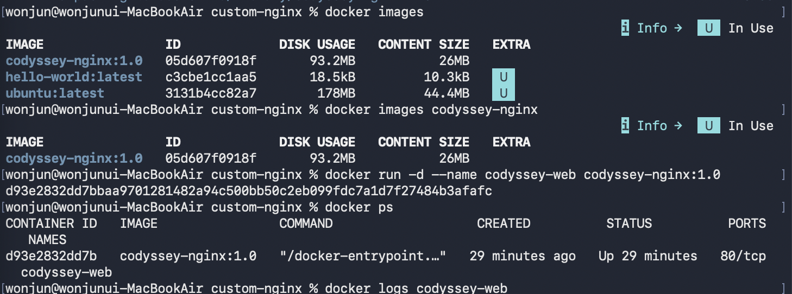

# Docker 설치와 기본 운영

[← README로 돌아가기](../README.md)

### 4-3. Docker 설치 및 기본 점검

OrbStack을 기반으로 설치한 Docker CLI와 Docker 엔진의 동작 상태를 확인했습니다.

#### Docker 버전 확인

```bash
$ docker --version
Docker version 29.4.0, build 9d7ad9f
```

`docker --version` 명령을 통해 현재 설치된 Docker CLI 버전을 확인했습니다.

#### Docker 엔진 동작 확인

```bash
$ docker info
Client:
 Version:    29.4.0
 Context:    orbstack
 Debug Mode: false
 Plugins:
  buildx: Docker Buildx (Docker Inc.)
    Version:  v0.33.0
    Path:     /Users/wonjun/.docker/cli-plugins/docker-buildx
  compose: Docker Compose (Docker Inc.)
    Version:  v5.1.2
    Path:     /Users/wonjun/.docker/cli-plugins/docker-compose
    ... 

Server:
 Server Version: 29.4.0
 Operating System: OrbStack
 Architecture: aarch64
 CPUs: 10
 Total Memory: 약 11.74 GiB
```
> `docker info`의 전체 출력에서 버전, 실행 환경, 아키텍처와 할당 자원 등 주요 부분만 기록했습니다.

`docker info` 명령에서 Client와 Server 정보가 모두 출력되는 것을 확인했습니다. 이를 통해 Docker CLI가 Docker 엔진과 정상적으로 연결된 상태임을 확인했습니다.

#### hello-world 컨테이너 실행

Docker 설치와 이미지 다운로드, 컨테이너 생성 및 실행 과정이 정상적으로 동작하는지 확인하기 위해 `hello-world` 이미지를 실행했습니다.

```bash
$ docker run --name hello-container hello-world
Unable to find image 'hello-world:latest' locally
latest: Pulling from library/hello-world
58dee6a49ef1: Pull complete 
c3bdf82c34d1: Download complete 
Digest: sha256:c3cbe1cc1aa588a64951ac6286e0df7b27fe2e6324b1001c619bb358770c0178
Status: Downloaded newer image for hello-world:latest

Hello from Docker!
This message shows that your installation appears to be working correctly.

To generate this message, Docker took the following steps:
 1. The Docker client contacted the Docker daemon.
 2. The Docker daemon pulled the "hello-world" image from the Docker Hub.
    (arm64v8)
 3. The Docker daemon created a new container from that image which runs the
    executable that produces the output you are currently reading.
 4. The Docker daemon streamed that output to the Docker client, which sent it
    to your terminal.

To try something more ambitious, you can run an Ubuntu container with:
 $ docker run -it ubuntu bash

Share images, automate workflows, and more with a free Docker ID:
 https://hub.docker.com/

For more examples and ideas, visit:
 https://docs.docker.com/get-started/
```

출력에서 다음 메시지를 확인했습니다.

```text
Hello from Docker!
This message shows that your installation appears to be working correctly.
```

이 과정에서 로컬에 `hello-world` 이미지가 없었기 때문에 Docker가 이미지를 다운로드한 뒤, 해당 이미지로 컨테이너를 생성하고 실행했습니다. 컨테이너는 메시지를 출력한 후 정상 종료되었습니다.

#### 이미지 목록 확인

```bash
% docker images
IMAGE                ID             DISK USAGE   CONTENT SIZE   EXTRA
hello-world:latest   c3cbe1cc1aa5       18.5kB         10.3kB    U   
```



`docker images` 명령을 통해 다운로드된 `hello-world` 이미지를 확인했습니다.

#### 실행 중인 컨테이너 확인

```bash
% docker ps
CONTAINER ID   IMAGE     COMMAND   CREATED   STATUS    PORTS     NAMES
```

`hello-world` 컨테이너는 메시지를 출력한 후 종료되기 때문에 실행 중인 컨테이너 목록에는 표시되지 않았습니다.

#### 전체 컨테이너 확인

```bash
% docker ps -a
CONTAINER ID   IMAGE         COMMAND    CREATED         STATUS                     PORTS     NAMES
2daaee979015   hello-world   "/hello"   2 minutes ago   Exited (0) 2 minutes ago             hello-container
```

`docker ps -a` 명령을 사용하자 종료된 `hello-container` 컨테이너가 표시되었습니다. 상태의 `Exited (0)`은 컨테이너가 오류 없이 정상적으로 종료되었음을 의미합니다.

#### 컨테이너 로그 확인

```bash
% docker logs hello-container
Hello from Docker!
This message shows that your installation appears to be working correctly.

To generate this message, Docker took the following steps:
 1. The Docker client contacted the Docker daemon.
 2. The Docker daemon pulled the "hello-world" image from the Docker Hub.
    (arm64v8)
 3. The Docker daemon created a new container from that image which runs the
    executable that produces the output you are currently reading.
 4. The Docker daemon streamed that output to the Docker client, which sent it
    to your terminal.

To try something more ambitious, you can run an Ubuntu container with:
 $ docker run -it ubuntu bash

Share images, automate workflows, and more with a free Docker ID:
 https://hub.docker.com/

For more examples and ideas, visit:
 https://docs.docker.com/get-started/

```

컨테이너가 종료된 이후에도 `docker logs` 명령을 사용하여 실행 당시 출력된 메시지를 확인할 수 있었습니다.

#### 이미지와 컨테이너의 차이

Docker 이미지는 컨테이너를 생성하기 위한 읽기 전용 실행 환경입니다. 컨테이너는 이미지를 기반으로 실제 생성되고 실행되는 인스턴스입니다.

같은 이미지 하나를 이용하여 여러 개의 컨테이너를 생성할 수 있습니다.

이미지에 포함된 파일을 변경하려면 Dockerfile을 수정하고 이미지를 다시 빌드해야 합니다. 반면 실행 중인 컨테이너에서 생성한 파일은 해당 컨테이너의 쓰기 가능한 계층에 기록되므로 컨테이너를 삭제하면 함께 사라질 수 있습니다. 영속적으로 보관해야 하는 데이터는 바인드 마운트나 Docker 볼륨에 저장해야 합니다.

### 4-4. Ubuntu 컨테이너 실행 및 내부 명령 실습
Ubuntu 이미지를 사용하여 컨테이너를 실행하고, 컨테이너 내부에서 기본적인 Linux 명령어를 수행했습니다.

Ubuntu 컨테이너 실행 및 내부 진입
```bash
% docker run -it --name ubuntu-practice ubuntu bash
Unable to find image 'ubuntu:latest' locally
latest: Pulling from library/ubuntu
693710ba2039: Pull complete 
55237ac9880d: Pull complete 
fdfb14aa961e: Download complete 
Digest: sha256:[전체 값 생략]
Status: Downloaded newer image for ubuntu:latest
root@28c7aae53230:/#

```
"docker run" 명령으로 Ubuntu 이미지를 기반으로 새로운 컨테이너를 생성하고 실행했습니다.

사용한 옵션은 다음과 같습니다.
-i: 표준 입력을 열린 상태로 유지합니다.
-t: 터미널 환경을 제공합니다.
--name ubuntu-practice: 컨테이너 이름을 ubuntu-practice로 지정합니다.
ubuntu: 사용할 Docker 이미지입니다.
bash: 컨테이너에서 실행할 기본 명령입니다.

2)컨테이너 내부 현재 위치 확인

```bash
root@28c7aae53230:/# pwd 
/

컨테이너 내부의 현재 위치는 루트 디렉토리인 /로 확인되었습니다.
```

2-1)컨테이너 내부 파일 목록 확인
```bash
root@28c7aae53230:/# ls -la
total 12
drwxr-xr-x   1 root root   6 Jul 28 03:31 .
drwxr-xr-x   1 root root   6 Jul 28 03:31 ..
-rwxr-xr-x   1 root root   0 Jul 28 03:31 .dockerenv
drwxr-xr-x   1 root root  26 Jul 13 16:25 .rock
lrwxrwxrwx   1 root root   7 Apr 20 08:46 bin -> usr/bin
....
```
ls -la 명령을 통해 Ubuntu 컨테이너 내부의 디렉토리와 숨김 파일을 포함한 전체 목록을 확인했습니다.

2-2)Ubuntu 운영체제 정보 확인

```bash

root@28c7aae53230:/# cat /etc/os-release 
PRETTY_NAME="Ubuntu 26.04 LTS"
NAME="Ubuntu"
VERSION_ID="26.04"
VERSION="26.04 LTS (Resolute Raccoon)"
VERSION_CODENAME=resolute
ID=ubuntu
ID_LIKE=debian
HOME_URL="https://www.ubuntu.com/"
SUPPORT_URL="https://help.ubuntu.com/"
BUG_REPORT_URL="https://bugs.launchpad.net/ubuntu/"
PRIVACY_POLICY_URL="https://www.ubuntu.com/legal/terms-and-policies/privacy-policy"
UBUNTU_CODENAME=resolute
LOGO=ubuntu-logo

/etc/os-release 파일을 확인하여 현재 컨테이너가 Ubuntu 환경에서 실행되고 있음을 확인했습니다.
```

2-3)문자열 출력 확인

```bash
root@28c7aae53230:/# echo "Hello from Ubuntu container"
Hello from Ubuntu container

echo 명령으로 컨테이너 내부에서 문자열이 정상적으로 출력되는 것을 확인했습니다.
```

2-4)디렉토리와 파일 생성
```bash
root@28c7aae53230:/# mkdir docker-practice
root@28c7aae53230:/# touch docker-practice/test.txt

docker-practice 디렉토리를 생성한 뒤, 해당 디렉토리 안에 test.txt 파일을 생성했습니다.
```

2-5)파일 내용 작성 및 확인
```bash
root@28c7aae53230:/# echo "Container data" > docker-practice/test.txt
root@28c7aae53230:/# cat docker-practice/test.txt
Container data

echo 명령과 출력 리다이렉션 기호인 >를 사용하여 파일에 내용을 작성하고, cat 명령으로 저장된 내용을 확인했습니다.
```

2-6)컨테이너 종료
```bash
root@28c7aae53230:/# exit
exit

컨테이너 내부에서 exit를 실행하자 bash 프로세스가 종료되었고, Ubuntu 컨테이너도 함께 중지되었습니다.
```

3)실행 중인 컨테이너 확인
```bash
$ docker ps
CONTAINER ID   IMAGE   COMMAND   CREATED   STATUS   PORTS   NAMES

ubuntu-practice 컨테이너는 종료된 상태이므로 실행 중인 컨테이너 목록에는 표시되지 않았습니다.
```

3-1)전체 컨테이너 확인
```bash
wonjun@wonjunui-MacBookAir ~ % docker ps -a
CONTAINER ID   IMAGE         COMMAND    CREATED          STATUS                      PORTS     NAMES
28c7aae53230   ubuntu        "bash"     30 minutes ago   Exited (0) 30 seconds ago             ubuntu-practice
2daaee979015   hello-world   "/hello"   14 hours ago     Exited (0) 14 hours ago               hello-container

- docker ps -a 명령을 사용하여 종료된 ubuntu-practice 컨테이너를 확인했습니다.
- 상태의 Exited (0)은 컨테이너가 오류 없이 정상적으로 종료되었음을 의미합니다.
```

3-2)종료된 컨테이너 다시 시작
```bash
$ docker start -ai ubuntu-practice
root@28c7aae53230:/#

docker start -ai 명령으로 기존에 생성된 ubuntu-practice 컨테이너를 다시 시작하고 내부 터미널에 연결했습니다.
-a: 컨테이너의 출력에 연결합니다.
-i: 컨테이너의 입력을 사용할 수 있도록 연결합니다.
```

3-3)기존 파일 유지 여부 확인

```bash
root@28c7aae53230:/# cat /docker-practice/test.txt
Container data

컨테이너를 중지한 뒤 다시 시작해도 이전에 생성한 파일과 내용이 그대로 유지되는 것을 확인했습니다.
이는 컨테이너가 삭제된 것이 아니라 중지되었다가 다시 실행되었기 때문입니다.
```

3-5)확인 후 컨테이너를 다시 종료했습니다.
```bash
root@컨테이너ID:/# exit
exit
```
4) 백그라운드 컨테이너 및 Docker 기본 운영 명령 실습

Ubuntu 컨테이너를 백그라운드에서 실행하고, 실행 중인 컨테이너에 docker exec 명령으로 진입했습니다. 이후 로그와 리소스 사용량을 확인하고 컨테이너를 중지했습니다.

4-1)벡그라운드 컨테이너 실행
```bash
docker run -d --name ubuntu-background ubuntu sleep infinity

d8e2b0e9f85fc5347fa2a822740a83030b2abd623744f4bbd3877a463e44ca38
w

-d 옵션을 사용하여 Ubuntu 컨테이너를 백그라운드에서 실행했습니다.
컨테이너가 바로 종료되지 않도록 기본 프로세스로 sleep infinity를 실행했습니다.
-d: 컨테이너를 백그라운드에서 실행합니다.
--name ubuntu-background: 컨테이너 이름을 지정합니다.
sleep infinity: 종료되지 않고 계속 대기하는 프로세스를 실행합니다.

```
4-2)실행중인 컨테이너 확인

```bash
docker ps 
CONTAINER ID   IMAGE     COMMAND            CREATED         STATUS         PORTS     NAMES
d8e2b0e9f85f   ubuntu    "sleep infinity"   2 minutes ago   Up 2 minutes             ubuntu-background

docker ps 명령을 통해 ubuntu-background 컨테이너가 Up 상태로 실행 중인 것을 확인했습니다.
```

4-3) docker exec로 컨테이너 내부 진입
```bash
docker exec -it ubuntu-background bash
root@d8e2b0e9f85f:/#  

docker exec 명령을 사용하여 이미 실행 중인 컨테이너 안에서 새로운 bash 프로세스를 실행했습니다.
```
4-4)컨테이너 내부 명령 실행
```bash
root@실제컨테이너ID:/# pwd
/

root@실제컨테이너ID:/# echo "Entered with docker exec"
Entered with docker exec

root@실제컨테이너ID:/# touch exec-test.txt

root@실제컨테이너ID:/# ls -l exec-test.txt

- 실제 출력 결과:
root@d8e2b0e9f85f:/# pwd
/
root@d8e2b0e9f85f:/# echo "Entered with docker exec" Entered with docker exec
Entered with docker exec Entered with docker exec
root@d8e2b0e9f85f:/# touch exec-test.txt
root@d8e2b0e9f85f:/# ls -l exec-test.txt
-rw-r--r-- 1 root root 0 Jul 28 05:43 exec-test.txt

컨테이너 내부에서 현재 위치를 확인하고 문자열을 출력했으며, exec-test.txt 파일을 생성했습니다.
```

4-5)xec로 실행한 셸 종료
```bash
root@d8e2b0e9f85f:/# exit
exit

exit 명령을 사용하여 docker exec로 실행한 Bash 셸을 종료했습니다.
```
4-6) 컨테이너 실행 상태 재확인

% docker ps
```bash
CONTAINER ID   IMAGE     COMMAND            CREATED          STATUS          PORTS     NAMES
d8e2b0e9f85f   ubuntu    "sleep infinity"   49 minutes ago   Up 49 minutes             ubuntu-background

Bash 셸에서 나왔지만 ubuntu-background 컨테이너는 계속 Up 상태로 실행되고 있었습니다.
이는 exit로 종료된 프로세스가 컨테이너의 기본 프로세스인 sleep infinity가 아니라, docker exec로 추가 실행한 bash 프로세스이기 때문입니다.
```

4-7) 컨테이너 로그 확인
```bash
% docker logs ubuntu-background

위 코드를 입력해도 별도의 로그가 출력되지 않았습니다.
컨테이너의 기본 프로세스인 sleep infinity가 표준 출력이나 표준 오류에 내용을 기록하지 않기 때문에 로그가 비어 있는 것이 정상입니다.
```

4-8) 컨테이너 리소스 사용량 확인
```bash
% docker stats ubuntu-background

- 출력결과:
CONTAINER ID   NAME                CPU %     MEM USAGE / LIMIT     MEM %     NET I/O         BLOCK I/O        PIDS
d8e2b0e9f85f   ubuntu-background   0.00%     2.156MiB / 11.74GiB   0.02%     1.13kB / 126B   51.9MB / 4.1kB   1
^C%
```

docker stats 명령을 사용하여 컨테이너의 CPU, 메모리, 네트워크, 디스크 사용량을 확인했습니다.
출력은 실시간으로 갱신되므로 확인 후 Control + C를 눌러 종료했습니다.

4-9) 컨테이너 중지
```bash
% docker stop ubuntu-background
ubuntu-background
```

`docker stop` 명령을 사용하여 실행 중인 컨테이너의 종료를 요청했습니다.

4-10) 실행 중인 컨테이너 재확인
``` bash
% docker ps

실제 출력 결과:
CONTAINER ID   IMAGE     COMMAND   CREATED   STATUS    PORTS     NAMES
```

중지된 ubuntu-background 컨테이너가 실행 중인 컨테이너 목록에서 사라진 것을 확인했습니다.

4-11) 전체 컨테이너 확인
```bash
% docker ps -a

실제 출력 결과
CONTAINER ID   IMAGE         COMMAND            CREATED          STATUS                       PORTS     NAMES
d8e2b0e9f85f   ubuntu        "sleep infinity"   59 minutes ago   Exited (137) 3 minutes ago             ubuntu-background
28c7aae53230   ubuntu        "bash"             2 hours ago      Exited (0) 2 hours ago                 ubuntu-practice
2daaee979015   hello-world   "/hello"           16 hours ago     Exited (0) 16 hours ago                hello-container
```

`docker ps -a` 명령에서는 `ubuntu-background` 컨테이너가 `Exited (137)` 상태로 표시되었습니다. 종료 코드 137은 프로세스가 `SIGKILL` 신호로 종료되었음을 의미하며, 정상 종료 코드인 0과 다릅니다. `docker stop`의 종료 유예 시간 안에 프로세스가 끝나지 않아 강제 종료된 경우 발생할 수 있으므로 실제 출력과 종료 방식을 함께 확인해야 합니다.

4-12) docker run, start, exec의 차이
docker run: 이미지를 기반으로 새로운 컨테이너를 생성하고 실행합니다.
docker start: 기존에 생성되어 중지된 컨테이너를 다시 실행합니다.
docker exec: 현재 실행 중인 컨테이너 안에서 추가 명령이나 프로세스를 실행합니다.
docker run -it ubuntu bash로 실행한 컨테이너는 Bash가 기본 프로세스이므로 exit를 입력하면 컨테이너도 중지됩니다.
반면 sleep infinity를 기본 프로세스로 실행한 컨테이너에 docker exec -it로 진입한 경우, exit는 추가로 실행된 Bash만 종료합니다. 따라서 기본 프로세스가 유지되는 동안 컨테이너도 계속 실행됩니다.

4-13)Docker 기본 운영 명령 실습 결과
이번 실습까지 다음 Docker 기본 운영 명령을 수행했습니다.
docker images: 로컬 이미지 목록 확인
docker ps: 실행 중인 컨테이너 확인
docker ps -a: 종료된 컨테이너를 포함한 전체 목록 확인
docker logs: 컨테이너 로그 확인
docker stats: 컨테이너 리소스 사용량 확인
docker stop: 실행 중인 컨테이너 중지
docker start: 중지된 컨테이너 재실행
docker exec: 실행 중인 컨테이너 안에서 추가 명령 실행
이를 통해 Docker 이미지와 컨테이너의 상태를 확인하고 컨테이너를 실행, 재시작, 중지하며 로그와 리소스를 점검하는 기본 관리 방법을 확인했습니다.
