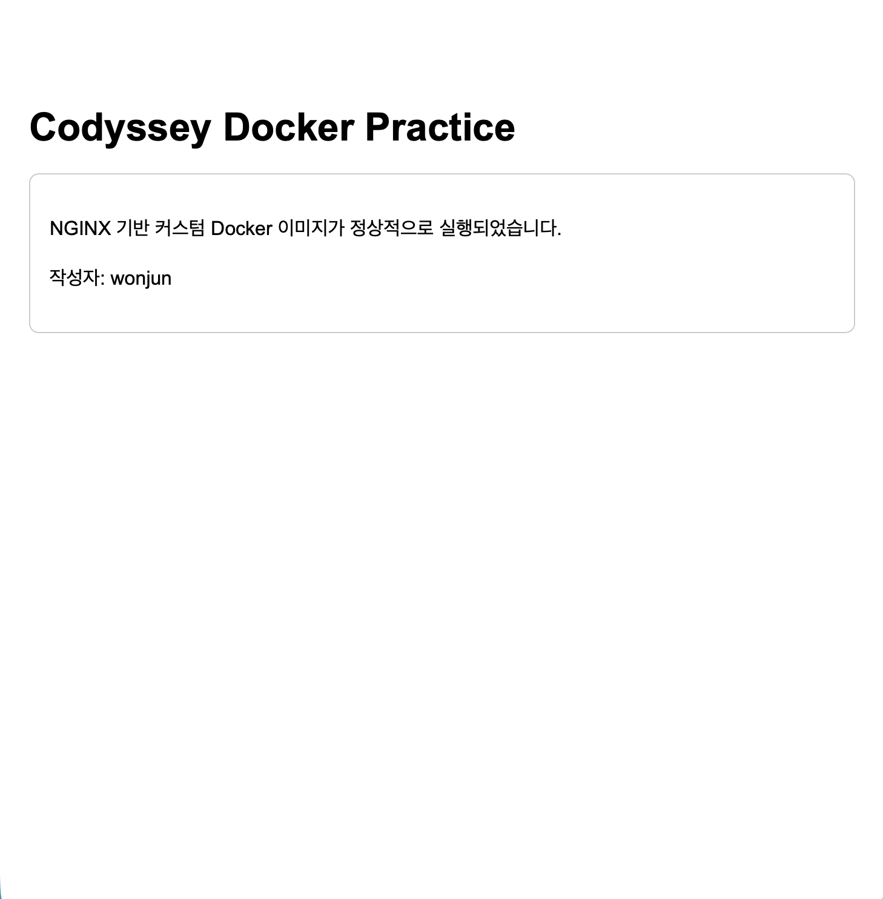

# 커스텀 NGINX 이미지와 포트 매핑

[← README로 돌아가기](../README.md)

### 4-5. NGINX 기반 커스텀 이미지 빌드

공식 NGINX 이미지를 베이스로 사용하고, 직접 작성한 정적 웹페이지를 포함한 커스텀 Docker 이미지를 제작했습니다.

#### 프로젝트 디렉토리 생성

```bash
$ mkdir -p /Users/wonjun/Developer/codyssey/codysseysetup/custom-nginx/app
$ cd /Users/wonjun/Developer/codyssey/codysseysetup/custom-nginx
$ pwd
/Users/wonjun/Developer/codyssey/codysseysetup/custom-nginx
```

커스텀 이미지 실습을 위한 디렉토리와 정적 웹페이지를 저장할 `app` 디렉토리를 생성했습니다.

프로젝트 구조는 다음과 같습니다.

```text
custom-nginx/
├── Dockerfile
├── app/
│   └── index.html
└── bind-app/
    └── index.html
```

#### 정적 웹페이지 작성

`app/index.html` 파일에 NGINX를 통해 제공할 정적 웹페이지를 작성했습니다.

```html
<!DOCTYPE html>
<html lang="ko">
<head>
  <meta charset="UTF-8">
  <meta name="viewport" content="width=device-width, initial-scale=1.0">
  <title>Codyssey Docker Practice</title>
</head>
<body>
  <h1>Codyssey Docker Practice</h1>
  <p>NGINX 기반 커스텀 Docker 이미지가 정상적으로 실행되었습니다.</p>
</body>
</html>
```

파일 내용을 확인했습니다.

```bash
$ cat app/index.html

- 실제 출력 결과:
<!DOCTYPE html>
<html lang="ko">
<head>
  <meta charset="UTF-8">
  <meta name="viewport" content="width=device-width, initial-scale=1.0">
  <title>Codyssey Docker Practice</title>
  <style>
    body {
      font-family: Arial, sans-serif;
      max-width: 720px;
      margin: 80px auto;
      padding: 0 24px;
      line-height: 1.6;
    }

    h1 {
      margin-bottom: 12px;
    }

    .status {
      padding: 16px;
      border: 1px solid #cccccc;
      border-radius: 8px;
    }
  </style>
</head>
<body>
  <h1>Codyssey Docker Practice</h1>

  <div class="status">
    <p>NGINX 기반 커스텀 Docker 이미지가 정상적으로 실행되었습니다.</p>
    <p>작성자: wonjun</p>
  </div>
</body>
</html>
```

#### Dockerfile 작성

아래 명령어로 Dockerfile을 생성합니다.

```bash
cat > Dockerfile <<'EOF'
```
이후 아래 코드를 작성합니다.

```dockerfile
FROM nginx:alpine

COPY app/index.html /usr/share/nginx/html/index.html

EXPOSE 80
```

작성한 Dockerfile의 각 명령은 다음 목적을 가집니다.

* `FROM nginx:alpine`: 공식 NGINX Alpine 이미지를 베이스 이미지로 사용합니다.
* `COPY`: 직접 작성한 `index.html`을 NGINX 기본 웹 문서 경로에 복사합니다.
* `EXPOSE 80`: 컨테이너의 NGINX 웹 서버가 80번 포트를 사용한다는 정보를 명시합니다.

Alpine 기반 이미지는 일반적인 Linux 이미지보다 크기가 작은 편이므로 간단한 정적 웹 서버 실습에 적합합니다.

#### 프로젝트 파일 확인

```bash
find . -maxdepth 2 -type f

- 출력 결과:
./.DS_Store
./app/index.html
./Dockerfile
```

빌드에 필요한 Dockerfile과 정적 웹페이지가 올바른 위치에 생성된 것을 확인했습니다.

#### 커스텀 이미지 빌드

```bash
docker build -t codyssey-nginx:1.0 .
- 빌드 출력 결과:
=> exporting to image                                                                           0.2s
 => => exporting layers                                                                          0.1s
 => => exporting manifest sha256:bc46906cddb0c8060ede08d60098d83625f09750e8f60af2c19b03cb73700c  0.0s
 => => exporting config sha256:586df5b3a4a114157d597584097a8f6ad05574d605ccf9075fc3fdac5ae2bdb0  0.0s
 => => exporting attestation manifest sha256:d42bdbd37ff07afac3ca70c48b23b65b68672a572fe1223267  0.0s
 => => exporting manifest list sha256:05d607f0918f24516374e698213a481f077126816fe64597b40110709  0.0s
 => => naming to docker.io/library/codyssey-nginx:1.0                                            0.0s
 => => unpacking to docker.io/library/codyssey-nginx:1.0 
```

`docker build` 명령을 사용하여 현재 디렉토리의 Dockerfile을 기반으로 이미지를 빌드했습니다.

* `-t codyssey-nginx:1.0`: 이미지 이름을 `codyssey-nginx`, 태그를 `1.0`으로 지정합니다.
* `.`: 현재 디렉토리를 Docker 빌드 컨텍스트로 지정합니다.

빌드 과정에서 `nginx:alpine` 베이스 이미지를 다운로드하고, 작성한 HTML 파일을 포함한 새로운 이미지가 생성되었습니다.

#### 생성된 이미지 확인

```bash
docker images codyssey-nginx
- 출력 결과:
IMAGE                ID             DISK USAGE   CONTENT SIZE   EXTRA
codyssey-nginx:1.0   05d607f0918f       93.2MB           26MB
```

이미지 목록에서 `codyssey-nginx:1.0`이 생성된 것을 확인했습니다.

#### 커스텀 이미지 기반 컨테이너 실행

```bash
docker run -d --name codyssey-web codyssey-nginx:1.0

- 컨테이너 ID:
d93e2832dd7bbaa9701281482a94c500bb50c2eb099fdc7a1d7f27484b3afafc
```

직접 빌드한 `codyssey-nginx:1.0` 이미지를 기반으로 `codyssey-web` 컨테이너를 백그라운드에서 실행했습니다.

#### 실행 상태 확인

```bash
docker ps
- 출력 결과:

CONTAINER ID   IMAGE                COMMAND                   CREATED          STATUS          PORTS     NAMES
d93e2832dd7b   codyssey-nginx:1.0   "/docker-entrypoint.…"   29 minutes ago   Up 29 minutes   80/tcp    codyssey-web
```

`codyssey-web` 컨테이너가 `Up` 상태로 실행되는 것을 확인했습니다.


#### 컨테이너 로그 확인

```bash
docker logs codyssey-web

- 출력 결과:
wonjun@wonjunui-MacBookAir custom-nginx % docker logs codyssey-web
/docker-entrypoint.sh: /docker-entrypoint.d/ is not empty, will attempt to perform configuration
/docker-entrypoint.sh: Looking for shell scripts in /docker-entrypoint.d/
/docker-entrypoint.sh: Launching /docker-entrypoint.d/10-listen-on-ipv6-by-default.sh
10-listen-on-ipv6-by-default.sh: info: Getting the checksum of /etc/nginx/conf.d/default.conf
10-listen-on-ipv6-by-default.sh: info: Enabled listen on IPv6 in /etc/nginx/conf.d/default.conf
/docker-entrypoint.sh: Sourcing /docker-entrypoint.d/15-local-resolvers.envsh
/docker-entrypoint.sh: Launching /docker-entrypoint.d/20-envsubst-on-templates.sh
/docker-entrypoint.sh: Launching /docker-entrypoint.d/30-tune-worker-processes.sh
/docker-entrypoint.sh: Configuration complete; ready for start up
2026/07/28 06:47:25 [notice] 1#1: using the "epoll" event method
2026/07/28 06:47:25 [notice] 1#1: nginx/1.31.3
2026/07/28 06:47:25 [notice] 1#1: built by gcc 15.2.0 (Alpine 15.2.0)
2026/07/28 06:47:25 [notice] 1#1: OS: Linux 7.0.11-orbstack-00360-gc9bc4d96ac70
2026/07/28 06:47:25 [notice] 1#1: getrlimit(RLIMIT_NOFILE): 20480:1048576
2026/07/28 06:47:25 [notice] 1#1: start worker processes
2026/07/28 06:47:25 [notice] 1#1: start worker process 30
2026/07/28 06:47:25 [notice] 1#1: start worker process 31
2026/07/28 06:47:25 [notice] 1#1: start worker process 32
2026/07/28 06:47:25 [notice] 1#1: start worker process 33
2026/07/28 06:47:25 [notice] 1#1: start worker process 34
2026/07/28 06:47:25 [notice] 1#1: start worker process 35
2026/07/28 06:47:25 [notice] 1#1: start worker process 36
2026/07/28 06:47:25 [notice] 1#1: start worker process 37
2026/07/28 06:47:25 [notice] 1#1: start worker process 38
2026/07/28 06:47:25 [notice] 1#1: start worker process 39

```

NGINX가 정상적으로 초기화되고 웹 서버 실행 준비가 완료된 것을 로그를 통해 확인했습니다.

#### 컨테이너 내부 HTML 파일 확인

```bash
docker exec codyssey-web cat /usr/share/nginx/html/index.html

- 출력 결과:
<!DOCTYPE html>
<html lang="ko">
<head>
  <meta charset="UTF-8">
  <meta name="viewport" content="width=device-width, initial-scale=1.0">
  <title>Codyssey Docker Practice</title>
  <style>
    body {
      font-family: Arial, sans-serif;
      max-width: 720px;
      margin: 80px auto;
      padding: 0 24px;
      line-height: 1.6;
    }

    h1 {
      margin-bottom: 12px;
    }

    .status {
      padding: 16px;
      border: 1px solid #cccccc;
      border-radius: 8px;
    }
  </style>
</head>
<body>
  <h1>Codyssey Docker Practice</h1>

  <div class="status">
    <p>NGINX 기반 커스텀 Docker 이미지가 정상적으로 실행되었습니다.</p>
    <p>작성자: wonjun</p>
  </div>
</body>
</html>
```

컨테이너 내부의 NGINX 웹 문서 경로에서 직접 작성한 HTML 내용이 출력되는 것을 확인했습니다.

이를 통해 Dockerfile의 `COPY` 명령으로 정적 웹페이지가 커스텀 이미지에 정상적으로 포함되었음을 검증했습니다.

#### 컨테이너 정리

```bash
docker stop codyssey-web
codyssey-web

docker rm codyssey-web
codyssey-web
```

다음 포트 매핑 실습에서 같은 이름으로 컨테이너를 다시 실행하기 위해 기존 컨테이너를 중지하고 삭제했습니다.

컨테이너를 삭제한 후에도 커스텀 이미지는 유지되는 것을 확인했습니다.

```bash
docker images codyssey-nginx

- 출력 결과:
IMAGE                ID             DISK USAGE   CONTENT SIZE   EXTRA
codyssey-nginx:1.0   05d607f0918f       93.2MB           26MB

```

#### 커스텀 이미지 제작 결과

공식 `nginx:alpine` 이미지를 기반으로 직접 작성한 정적 웹페이지를 추가하여 `codyssey-nginx:1.0` 커스텀 이미지를 제작했습니다.

Docker 이미지는 애플리케이션 실행에 필요한 파일과 설정을 포함하는 템플릿이며, 빌드한 이미지로부터 실제 실행 인스턴스인 컨테이너를 생성할 수 있음을 확인했습니다.


### 4-6. 포트 매핑 및 웹페이지 접속 확인

직접 빌드한 `codyssey-nginx:1.0` 이미지를 실행하고, 호스트 포트와 컨테이너 포트를 연결하여 브라우저와 `curl`로 웹페이지에 접속했습니다.

#### 기존 컨테이너 확인 및 정리

```bash
docker ps -a --filter name=codyssey-web

- 출력 결과:
CONTAINER ID   IMAGE     COMMAND   CREATED   STATUS    PORTS     NAMES

```

같은 이름의 기존 컨테이너가 있는 경우 다음 명령으로 삭제했습니다.

```bash
$ docker rm -f codyssey-web
codyssey-web
```

#### 포트 매핑을 적용한 컨테이너 실행

```bash
docker run -d --name codyssey-web -p 8080:80 codyssey-nginx:1.0
- 컨테이너 ID:
9aa1285adf313a08e91f2fd01853a528474f3378eed3c885ecf702e4609a0011

```

`-p 8080:80` 옵션을 사용하여 호스트의 8080번 포트와 컨테이너의 80번 포트를 연결했습니다.

```text
호스트 8080번 포트 → 컨테이너 80번 포트
```

컨테이너 내부에서 NGINX는 80번 포트를 사용하고, 사용자는 Mac의 `localhost:8080` 주소를 통해 컨테이너의 웹 서버에 접근합니다.

#### 실행 상태와 포트 매핑 확인

```bash
docker ps
- 출력 결과:
CONTAINER ID   IMAGE                COMMAND                   CREATED          STATUS          PORTS                                     NAMES
9aa1285adf31   codyssey-nginx:1.0   "/docker-entrypoint.…"   45 seconds ago   Up 44 seconds   0.0.0.0:8080->80/tcp, [::]:8080->80/tcp   codyssey-web
```

출력의 `PORTS` 항목에서 다음과 같은 연결 정보를 확인했습니다.

```text
0.0.0.0:8080->80/tcp
```

포트 연결 정보도 별도로 확인했습니다.

```bash
docker port codyssey-web

- 출력 결과:
80/tcp -> 0.0.0.0:8080
80/tcp -> [::]:8080
```

이를 통해 컨테이너의 80번 포트가 호스트의 8080번 포트로 공개된 것을 확인했습니다.

#### curl을 사용한 접속 확인

```bash
curl http://localhost:8080

- HTML 응답:
wonjun@wonjunui-MacBookAir custom-nginx % curl http://localhost:8080
<!DOCTYPE html>
<html lang="ko">
<head>
  <meta charset="UTF-8">
  <meta name="viewport" content="width=device-width, initial-scale=1.0">
  <title>Codyssey Docker Practice</title>
  <style>
    body {
      font-family: Arial, sans-serif;
      max-width: 720px;
      margin: 80px auto;
      padding: 0 24px;
      line-height: 1.6;
    }

    h1 {
      margin-bottom: 12px;
    }

    .status {
      padding: 16px;
      border: 1px solid #cccccc;
      border-radius: 8px;
    }
  </style>
</head>
<body>
  <h1>Codyssey Docker Practice</h1>

  <div class="status">
    <p>NGINX 기반 커스텀 Docker 이미지가 정상적으로 실행되었습니다.</p>
    <p>작성자: wonjun</p>
  </div>
</body>
</html>

```

`curl` 명령을 사용했을 때 직접 작성한 `index.html` 내용이 출력되는 것을 확인했습니다.

응답 상태도 확인했습니다.

```bash
$ curl -I http://localhost:8080
HTTP/1.1 200 OK
Server: nginx/1.31.3
Date: Tue, 28 Jul 2026 07:39:37 GMT
Content-Type: text/html
Content-Length: 718
Last-Modified: Tue, 28 Jul 2026 06:30:51 GMT
Connection: keep-alive
ETag: "6a684c9b-2ce"
Accept-Ranges: bytes

```

출력에서 다음 상태를 확인했습니다.

```text
HTTP/1.1 200 OK
```

`200 OK`는 NGINX가 요청을 정상적으로 처리하고 웹페이지를 반환했음을 의미합니다.

#### 브라우저 접속 확인

브라우저 주소창에 다음 주소를 입력했습니다.

```text
http://localhost:8080
```

직접 작성한 정적 웹페이지가 정상적으로 표시되는 것을 확인했습니다.



현재 이미지는 웹페이지 응답 화면을 보여 줍니다. 최종 제출 전에는 평가 규칙에 맞게 브라우저 주소창의 `http://localhost:8080`과 응답 화면이 한 화면에 보이는 스크린샷으로 교체해야 합니다.

#### 컨테이너 접속 로그 확인

```bash
docker logs codyssey-web

- 출력 결과:
wonjun@wonjunui-MacBookAir custom-nginx %  docker logs codyssey-web
/docker-entrypoint.sh: /docker-entrypoint.d/ is not empty, will attempt to perform configuration
/docker-entrypoint.sh: Looking for shell scripts in /docker-entrypoint.d/
/docker-entrypoint.sh: Launching /docker-entrypoint.d/10-listen-on-ipv6-by-default.sh
10-listen-on-ipv6-by-default.sh: info: Getting the checksum of /etc/nginx/conf.d/default.conf
10-listen-on-ipv6-by-default.sh: info: Enabled listen on IPv6 in /etc/nginx/conf.d/default.conf
/docker-entrypoint.sh: Sourcing /docker-entrypoint.d/15-local-resolvers.envsh
/docker-entrypoint.sh: Launching /docker-entrypoint.d/20-envsubst-on-templates.sh
/docker-entrypoint.sh: Launching /docker-entrypoint.d/30-tune-worker-processes.sh
/docker-entrypoint.sh: Configuration complete; ready for start up
2026/07/28 07:32:15 [notice] 1#1: using the "epoll" event method
2026/07/28 07:32:15 [notice] 1#1: nginx/1.31.3
2026/07/28 07:32:15 [notice] 1#1: built by gcc 15.2.0 (Alpine 15.2.0)
2026/07/28 07:32:15 [notice] 1#1: OS: Linux 7.0.11-orbstack-00360-gc9bc4d96ac70
2026/07/28 07:32:15 [notice] 1#1: getrlimit(RLIMIT_NOFILE): 20480:1048576
2026/07/28 07:32:15 [notice] 1#1: start worker processes
2026/07/28 07:32:15 [notice] 1#1: start worker process 30
2026/07/28 07:32:15 [notice] 1#1: start worker process 31
2026/07/28 07:32:15 [notice] 1#1: start worker process 32
2026/07/28 07:32:15 [notice] 1#1: start worker process 33
2026/07/28 07:32:15 [notice] 1#1: start worker process 34
2026/07/28 07:32:15 [notice] 1#1: start worker process 35
2026/07/28 07:32:15 [notice] 1#1: start worker process 36
2026/07/28 07:32:15 [notice] 1#1: start worker process 37
2026/07/28 07:32:15 [notice] 1#1: start worker process 38
2026/07/28 07:32:15 [notice] 1#1: start worker process 39
192.168.215.1 - - [28/Jul/2026:07:34:24 +0000] "GET / HTTP/1.1" 200 718 "-" "curl/8.7.1" "-"
192.168.215.1 - - [28/Jul/2026:07:39:37 +0000] "HEAD / HTTP/1.1" 200 0 "-" "curl/8.7.1" "-"
192.168.215.1 - - [28/Jul/2026:07:40:38 +0000] "GET / HTTP/1.1" 200 718 "-" "Mozilla/5.0 (Macintosh; Intel Mac OS X 10_15_7) AppleWebKit/605.1.15 (KHTML, like Gecko) Version/26.5.2 Safari/605.1.15" "-"
2026/07/28 07:40:38 [error] 32#32: *3 open() "/usr/share/nginx/html/favicon.ico" failed (2: No such file or directory), client: 192.168.215.1, server: localhost, request: "GET /favicon.ico HTTP/1.1", host: "localhost:8080", referrer: "http://localhost:8080/"
192.168.215.1 - - [28/Jul/2026:07:40:38 +0000] "GET /favicon.ico HTTP/1.1" 404 153 "http://localhost:8080/" "Mozilla/5.0 (Macintosh; Intel Mac OS X 10_15_7) AppleWebKit/605.1.15 (KHTML, like Gecko) Version/26.5.2 Safari/605.1.15" "-"

```

브라우저와 `curl`을 통한 요청이 NGINX 접근 로그에 기록된 것을 확인했습니다.

```text
GET / HTTP/1.1" 200
HEAD / HTTP/1.1" 200
```

`GET`은 웹페이지 내용을 요청한 기록이며, `HEAD`는 응답 본문 없이 헤더만 요청한 기록입니다. 상태 코드 `200`은 요청이 정상적으로 처리되었음을 나타냅니다.

#### 포트 매핑이 필요한 이유

Docker 컨테이너는 호스트와 분리된 네트워크 환경에서 실행됩니다. 따라서 컨테이너 내부에서 NGINX가 80번 포트로 동작하더라도 호스트에서 바로 접근할 수 있는 것은 아닙니다.

`-p 8080:80` 옵션을 사용하면 호스트의 8080번 포트로 들어온 요청이 컨테이너 내부의 80번 포트로 전달됩니다.

Dockerfile의 `EXPOSE 80`은 이미지가 사용할 포트를 설명하는 정보이며, 실제로 호스트와 포트를 연결하는 기능은 `docker run` 명령의 `-p` 옵션이 담당합니다.

#### 네트워크와 보안 고려사항

컨테이너는 호스트와 분리된 네트워크 네임스페이스에서 실행됩니다. `-p 8080:80`은 기본적으로 `0.0.0.0`과 `[::]`에 바인딩되어 같은 네트워크의 다른 장치에서도 접근할 가능성이 있으므로, 개발 중 로컬 접근만 필요하다면 다음처럼 루프백 주소를 명시하는 편이 안전합니다.

```bash
docker run -d --name codyssey-web-local -p 127.0.0.1:8080:80 codyssey-nginx:1.0
```

공개 포트는 필요한 것만 열고, 운영 환경에서는 방화벽·인증·TLS 설정을 함께 고려해야 합니다.

#### 포트 충돌 진단

8080번 포트를 이미 다른 프로그램이 사용하면 컨테이너 실행이 실패합니다. 다음 순서로 점검합니다.

```bash
# 1. Docker 컨테이너의 포트 사용 여부 확인
docker ps --format 'table {{.Names}}\t{{.Ports}}'

# 2. macOS에서 8080 포트를 사용하는 프로세스 확인
lsof -nP -iTCP:8080 -sTCP:LISTEN

# 3. 기존 서비스를 중지할 수 없다면 호스트 포트를 8081로 변경
docker run -d --name codyssey-web-8081 -p 8081:80 codyssey-nginx:1.0
```

컨테이너 내부 포트 80은 유지하면서 호스트 포트만 바꿀 수 있습니다.

#### 포트 매핑 실습 결과

직접 제작한 커스텀 이미지로 컨테이너를 실행하고 호스트와 컨테이너의 포트를 연결했습니다.

`docker ps`, `docker port`, `curl`, 브라우저 접속 및 `docker logs`를 통해 다음 내용을 확인했습니다.

* 컨테이너가 정상적으로 실행됨
* 호스트의 8080번 포트와 컨테이너의 80번 포트가 연결됨
* 브라우저와 터미널에서 정적 웹페이지에 접속 가능함
* 요청 기록이 NGINX 로그에 남음
